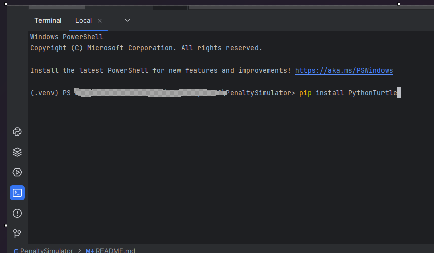
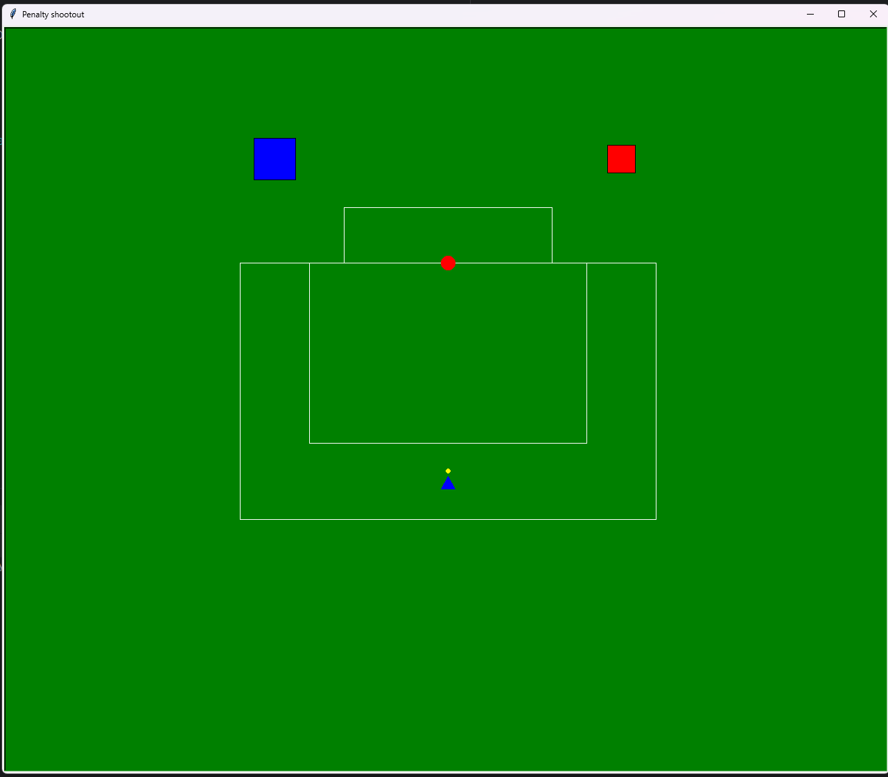
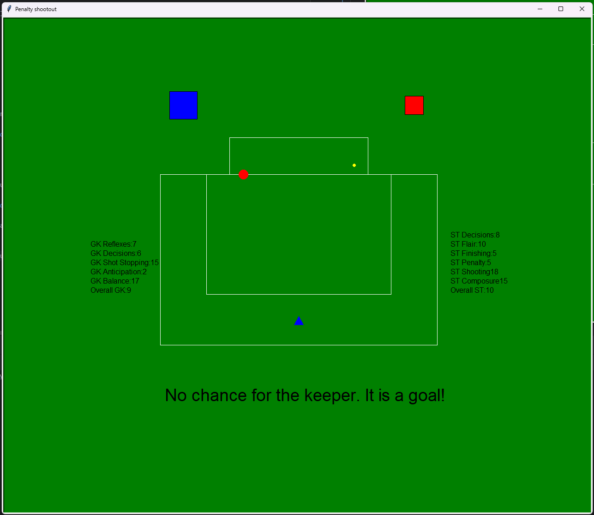

# Python Turtle Project

This is my first project in Python trying to implement the Turtle library. This project was realised sometimes back in 2019 when I was trying to learn Python for fun. The ideea behind it is that there is a Goalkeeper and a Striker. Each of them will be generated some random attributes and whoever has the higher attributes will win. The model is more skewed towards the Striker as it is a Penaly after all.

This is a very raw and primitive project, I know it is not efficient but I am still proud of it. :D

## Table of content

- [Installation](#installation)
- [Usage](#usage)

## Installation

1. Clone the repository
2. Open the terminal window in PyCharm or in your preferred IDE and write the following command "pip install PythonTurtle".

## Usage

1. Run the main.py
2. This window will open up with 2 buttons on each side, a blue button and a red button.

3. Press on the blue button to generate a set of attributes and see if the Striker will score or not. Press on the red button to stop the application.

This is how 1 simulated outcome would look like.

As a final note, I know currently you can spam the blue button to generate overlapping simulations, not ideal. 